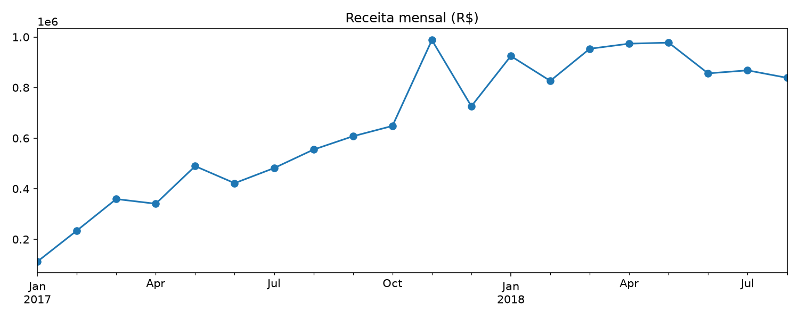
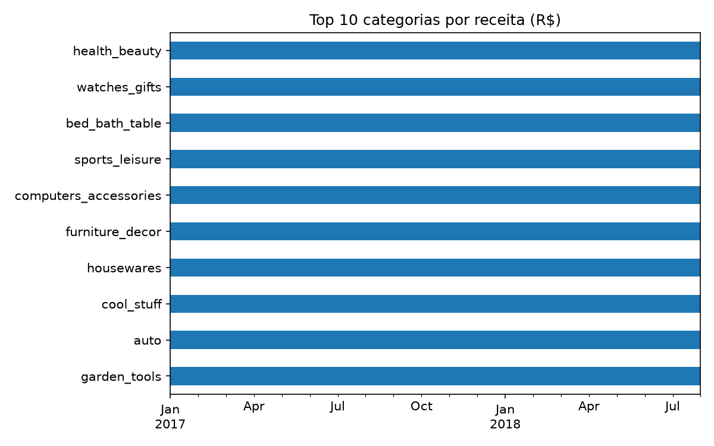
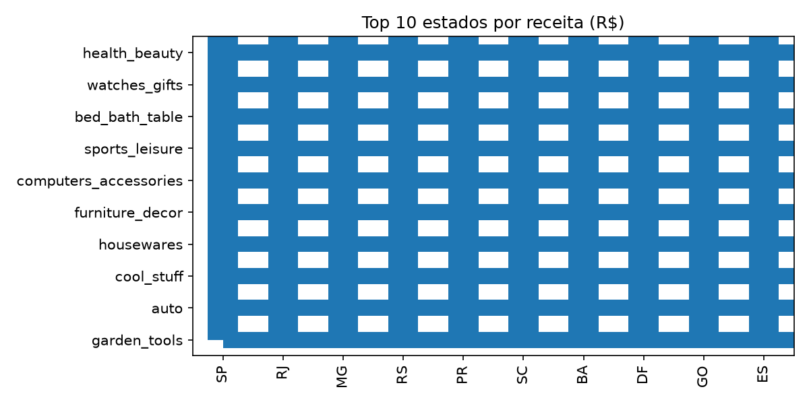
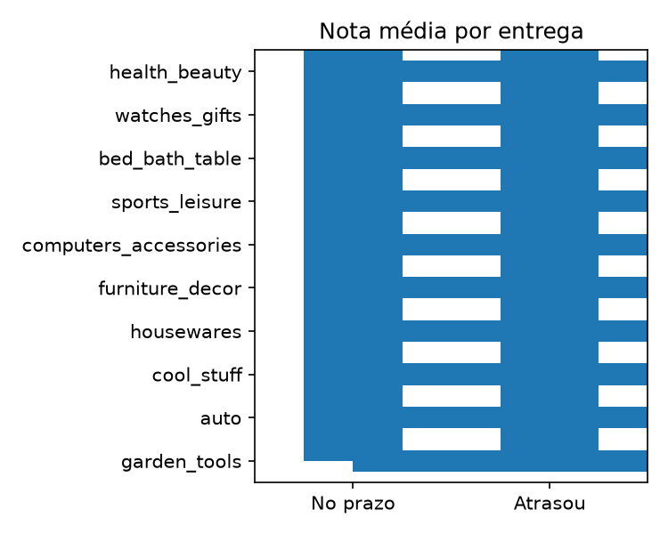

# Análise de vendas de e-commerce (Olist)

Projeto de análise exploratória de dados com Python usando o dataset público da Olist, um marketplace brasileiro.
O objetivo é responder perguntas de negócio a partir dos dados de pedidos, produtos, clientes e avaliações.

## Perguntas de negócio

1. Como as vendas evoluíram ao longo do tempo?
2. Quais categorias geram mais receita?
3. Quais estados mais compram?
4. Qual o ticket médio?
5. Atraso na entrega afeta a nota de avaliação?

## Ferramentas

Python, pandas, matplotlib, VS Code, Git e GitHub.

## Dados

[Brazilian E-Commerce Public Dataset by Olist](https://www.kaggle.com/datasets/olistbr/brazilian-ecommerce) (Kaggle).
Os arquivos CSV não estão neste repositório. Baixe do Kaggle e coloque na pasta `data/`.

## Como rodar

```bash
git clone https://github.com/juliapramos2006-bit/analise-vendas-olist.git
cd analise-vendas-olist
pip install pandas matplotlib
# coloque os CSVs do Kaggle na pasta data/
python analise_olist.py
```

## Principais resultados

- **Crescimento:** a receita de jan–ago/2018 foi **141% maior** que a de jan–ago/2017.
- **Categorias:** health_beauty, watches_gifts e bed_bath_table concentram **25,9%** da receita.
- **Estados:** São Paulo responde por **38,4%** da receita.
- **Ticket médio:** **R$ 137,00** por pedido (sem frete).
- **Entregas:** cerca de **8%** dos pedidos chegaram com atraso.
- **Satisfação:** pedidos atrasados têm nota média de **2,57**, contra **4,29** dos entregues no prazo.






## Recomendações

- Priorizar a redução de atrasos na entrega, porque o impacto na nota é grande.
- Reforçar estoque e divulgação das categorias líderes em receita.
- Avaliar ações para estados com baixa participação, já que as vendas estão concentradas em SP.

Observação: os dados mostram que atraso e nota baixa andam juntos, mas isso não prova que o atraso é a única causa da insatisfação.

## Decisões de análise

- Considerei só pedidos com status `delivered`.
- Usei o período de jan/2017 a ago/2018, porque 2016 e o fim de 2018 têm poucos pedidos.
- Receita = soma do preço dos itens, sem frete.

## Próximos passos

- Montar um dashboard em Power BI com esses dados.
- Consultar os dados com SQL.
- Publicar os indicadores via API na nuvem.

## Autora

Júlia Pimentel Ramos — [GitHub](https://github.com/juliapramos2006-bit)
